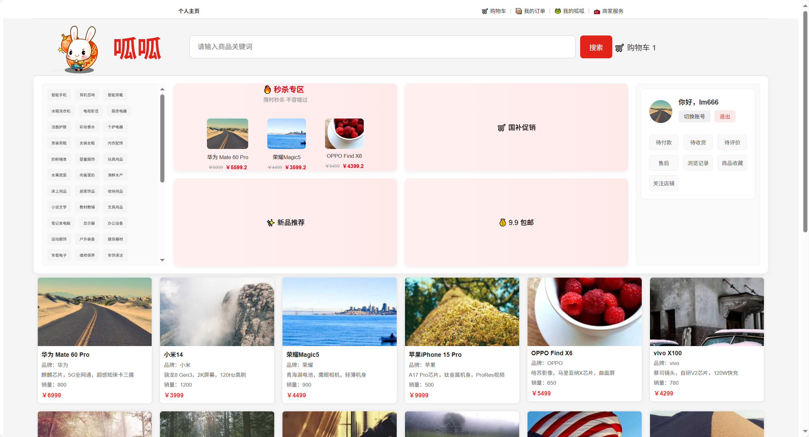
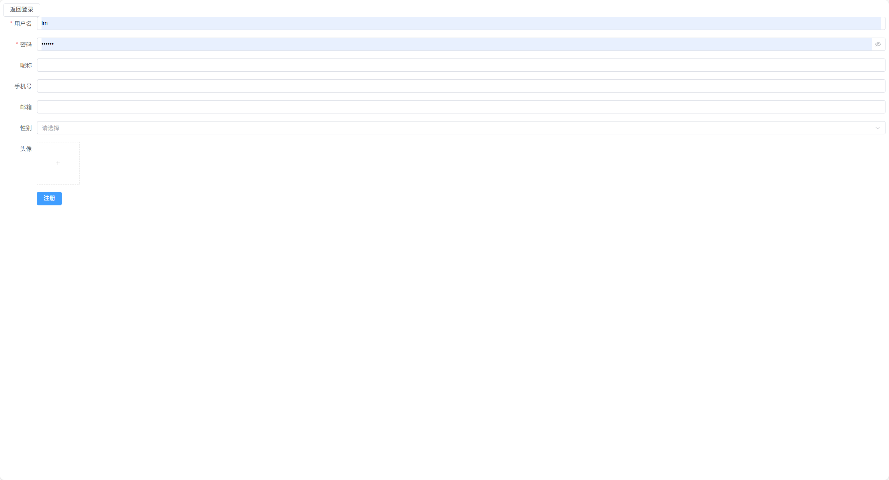
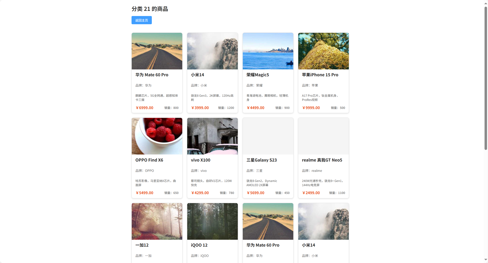
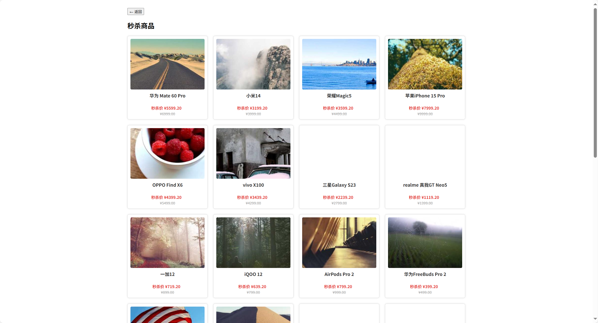
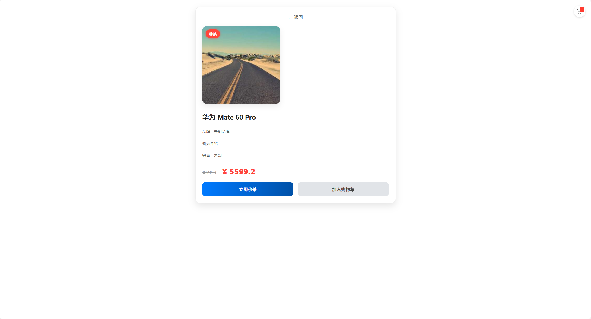
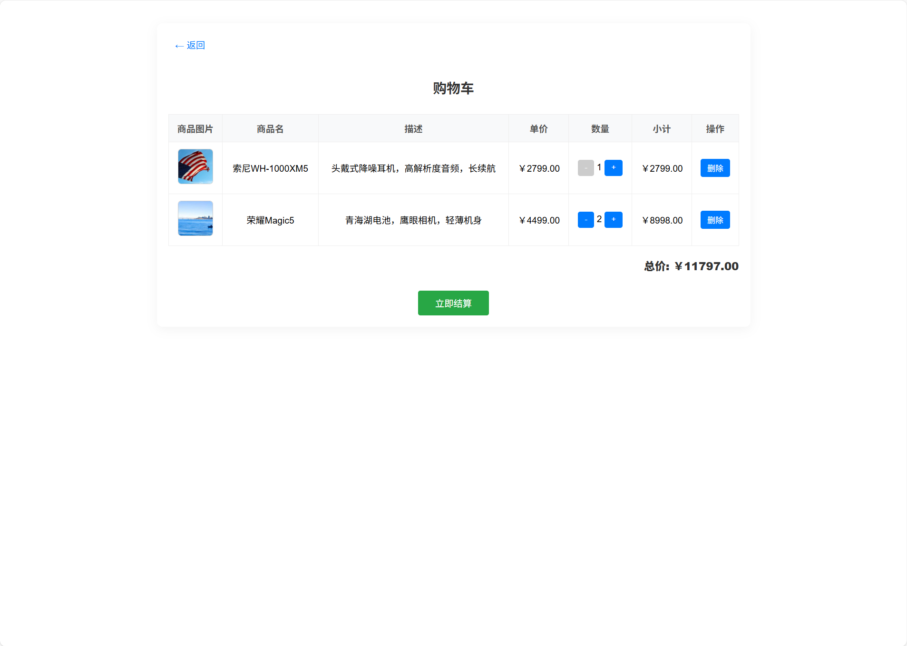
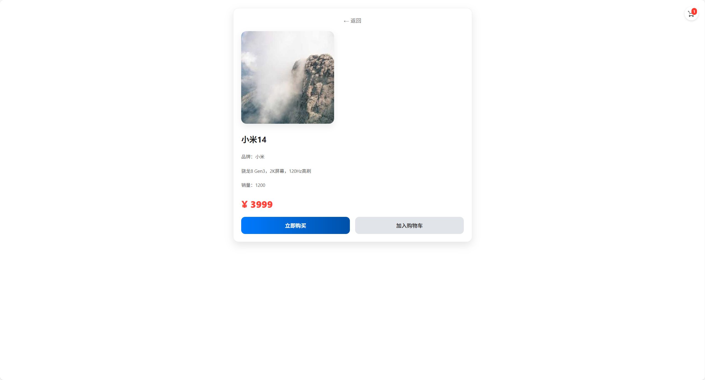

## 平台简介
这是一个仿京东的电商平台，呱呱是洛克王国里的一只宠物  
使用若依的框架开发，还用了用coplit,聪明又智障  
实现的功能大概就是下边了，前端是胡乱搞的  

## 项目主要功能

-  用户模块：注册、登录、头像昵称显示、Token登录态维护  
-  商品模块：商品管理、商品展示、分类列表、搜索  
-  搜索模块：使用 Elasticsearch 实现商品全文搜索（支持名称、品牌、分类、描述）  
-  秒杀系统：Redis 原子扣库存 + RabbitMQ 异步下单 + 防重复购买  
-  购物车模块：Redis 存储购物车数据，支持定时持久化到 MySQL  
-  首页推荐：热门、新品、推荐商品展示  
-  后台管理：基于若依原生权限控制体系，支持菜单配置、角色权限、日志记录等  

---

## 功能截图
###  首页
 
###  推荐
   
###  登录与注册
  
  
###  分类商品浏览
  
###  秒杀商品
  
  
###  购物车
  

  
###  搜索
  

